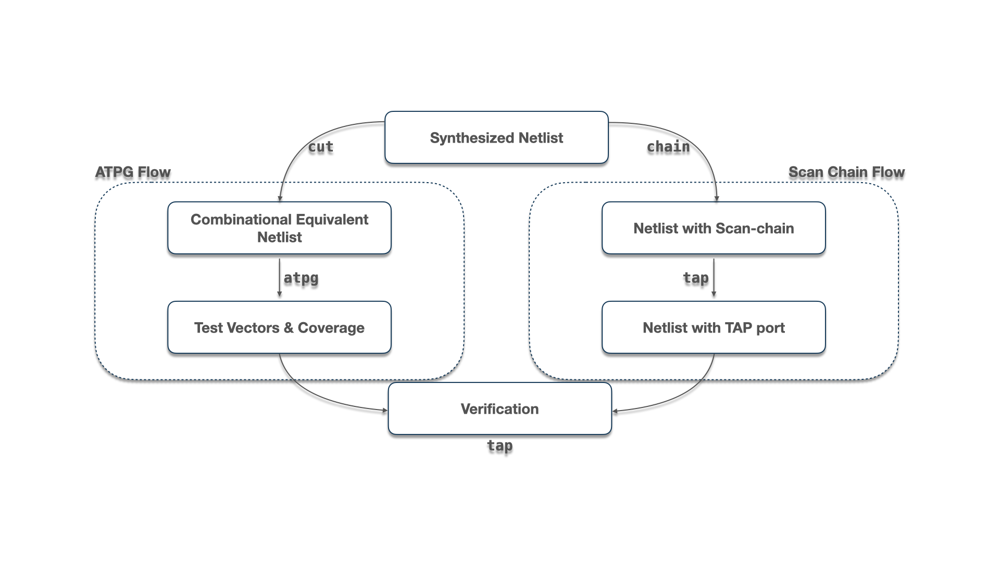

<h1 align="center">🧪 Fault</h1>

  
  
  

   

Fault is a complete open source design for testing (DFT) Solution that includes automatic test pattern generation for netlists, scan chain stitching, synthesis scripts and a number of other convenience features.

# Installation and Usage
See the documentation at https://fault.readthedocs.io.

# Copyright & Licensing
All rights reserved ©2018-2024 The American University in Cairo and other contributors. Fault is available under the Apache 2.0 License: See `License`.

SOFTWARE INCLUDED WITH SOME FAULT DISTRIBUTIONS, I.E. ATALANTA AND PODEM, WHILE
FREE TO DISTRIBUTE, ARE PROPRIETARY, AND MAY NOT BE USED FOR COMMERCIAL
PURPOSES.

# References
- Z. Navabi, Digital System Test and Testable Design : Using Hdl Models and
  Architectures. 2010;2011;. DOI: 10.1007/978-1-4419-7548-5.
  [Book](https://ieeexplore.ieee.org/book/5266057)
- Shinya Takamaeda-Yamazaki: Pyverilog: A Python-based Hardware Design
  Processing Toolkit for Verilog HDL, 11th International Symposium on Applied
  Reconfigurable Computing (ARC 2015) (Poster), Lecture Notes in Computer
  Science, Vol.9040/2015, pp.451-460, April 2015.
  [Paper](http://link.springer.com/chapter/10.1007/978-3-319-16214-0_42)

# Publication(s)
- M. Abdelatty, M. Gaber, M. Shalan, "Fault: Open Source EDA’s Missing DFT
  Toolchain," IEEE Design & Test Magazine. April 2021.
  [Paper](https://ieeexplore.ieee.org/document/9324799)
- Mohamed Gaber, Manar Abdelatty, and Mohamed Shalan, "Fault, an Open Source DFT
  Toolchain," Article No.13, Workshop on Open-Source EDA Technology (WOSET),
  2019. [Paper](https://woset-workshop.github.io/PDFs/2019/a13.pdf)

